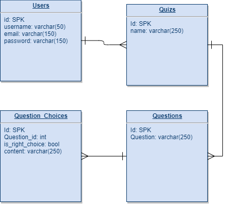

# Quizi

- [Overview](#overview)
- [MVP](#mvp)
  - [Goals](#goals)
  - [Libraries and Dependencies](#libraries-and-dependencies)
  - [Client (Front End)](#client-front-end)
    - [Wireframes](#wireframes)
    - [Component Hierarchy](#component-hierarchy)
    - [Component Breakdown](#component-breakdown)
    - [Time Estimates](#time-estimates)
  - [Server (Back End)](#server-back-end)
    - [ERD Model](#erd-model)
- [Post-MVP](#post-mvp)
- [Code Showcase](#code-showcase)
- [Code Issues & Resolutions](#code-issues--resolutions)

<br>

## Overview

**Quizi** is an application that allows to users to build their own Quizes and share them with public.

<br>

## MVP

The MVP for **Quizi** will feature user creation, authentication, the ability to create a Quiz and its questions choices.

<br>

### Goals

- _User CRUD_
- _Quiz CRUD_
- _Questions CRUD_
- _Choices CRUD_

<br>

### Libraries and Dependencies

|    Library    | Description                                                          |
| :-----------: | :--------------------------------------------------------------------|
|     React     | _Library for building front end interfaces with JSX_                 |
| React Router  | _Library for simulating route changes in React apps_                 |
|  TailwindCss  | _A utility-first CSS framework for rapidly building custom designs._ |
| Ruby on Rails | _Framework for building back ends with Ruby_                         |
|    bcrypt     | _Library for hashing passwords_                                      |
|      JWT      | _Library for creating tokens_                                        |

<br>

### Client (Front End)

#### Wireframes


- Homepage


- QuizBuild


- Quiz


#### Component Hierarchy

```structure

src
|__ proposal/
|__ services/
      |__ apiConfig.js
      |__ auth.js
      |__ users.js
      |__ quizes.js
|__ components/
      |__ nav/
            |__ nav.component.jsx
            |__ nav.styles.css
      |__ quiz/
            |__ quiz.component.jsx
            |__ quiz.styles.css
      |__ question/
            |__ question.component.jsx
            |__ question.styles.css
      |__ choice/
            |__ choice.component.jsx
            |__ choice.styles.css
|__ pages/
      |__ homepage/
            |__ homepage.component.jsx
            |__ homepage.styles.css
      |__ signin/
            |__ signin.component.jsx
            |__ signin.styles.css
      |__ signup/
            |__ signup.component.jsx
            |__ signup.styles.css
      |__ quizes/
            |__ quizes.component.jsx
            |__ quizes.styles.css

```

#### Component Breakdown

| Component     |    Type    | state | props | Description                      |
| :-------:     | :--------: | :---: | :---: | :------------------------------- |
|    Nav        | functional |   n   |   n   | __                               |
| Homepage      | functional |   y   |   n   | _Shows quizes_                   |
|   Quiz        | functional |   y   |   y   | _Create quiz_                    |
|   Question    | functional |   y   |   y   | _Create question_                |
|   Choice      | functional |   y   |   y   | _Create choice_                  |
|  Sign In      | functional |   y   |   y   | _Sign In_                        |
|  Sign Up      | functional |   y   |   y   | _Sign Up_                        |

#### Time Estimates

| Task      | Priority | Estimated Time | Time Invested | Actual Time |
| --------- | :------: | :------------: | :-----------: | :---------: |
| Init      |    H     |      2 hr      |     0 hrs     |    0 hrs    |
| Styling   |    M     |      8 hrs     |     0 hrs     |    0 hrs    |
| Front End |    H     |     32 hrs     |     0 hrs     |    0 hrs    |
| Back End  |    H     |     16 hrs     |     0 hrs     |    0 hrs    |
| TOTAL     |          |     58 hrs     |     0 hrs     |     TBD     |

<br>

### Server (Back End)

#### ERD Model



<br>

---

## Post-MVP

- Ability to share a Quiz
- Add multiple Quiz type
- Allow Quiz participation

---

## Code Showcase

> Use this section to include a brief code snippet of functionality that you are proud of and a brief description.

## Code Issues & Resolutions

> Use this section to list of all major issues encountered and their resolution.